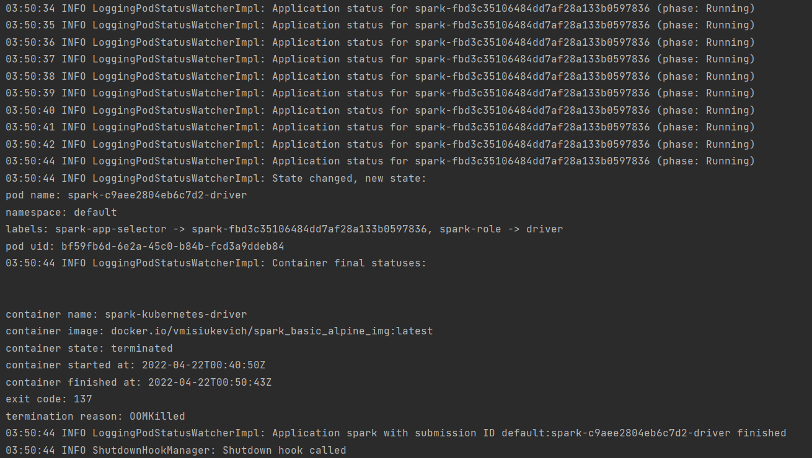
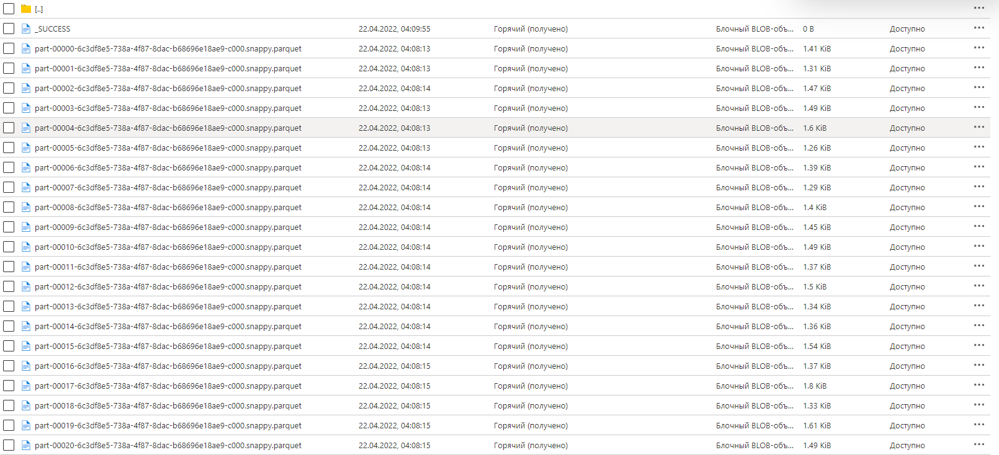
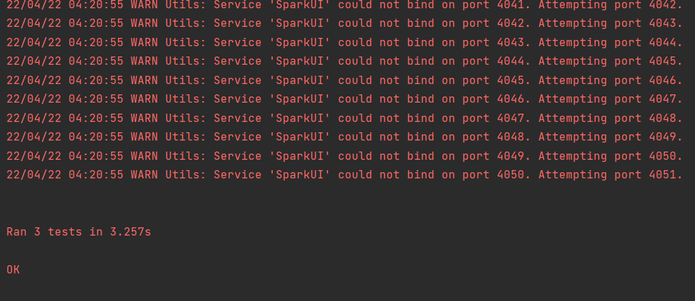

# Installation
```bash
git clone https://github.com/Vlad-Misiukevich/m06_sparkbasics_python_azure.git
```
# Requirements
* Python 3.8
* JDK 11.0.1
* Windows OS
* Docker v 20.10.12
* Spark v 3.1.3
* Hadoop v 3.2
* kubernetes-cli
* azure-cli
* terraform
# Usage
1. Install requirements into your env  
`pip install -r requirements.txt`  
2. Login to Azure  
`az login`
3. Deploy infrastructure with terraform  
`terraform init`  
`terraform plan -out terraform.plan`  
`terraform apply terraform.plan`
4. Connect to kubernetes cluster  
```
az aks get-credentials \
    --resource-group rg-vmisiukevich-westeurope \
    --name aks-vmisiukevich-westeurope \
    --subscription 9e5b0b80-8805-4b33-8b84-410263caf100
```
5. Run the proxy for Kubernetes API server  
`kubectl proxy`  
6. Create service’s account and assign the role  
```commandline
kubectl create serviceaccount spark2 
kubectl create clusterrolebinding spark2-role \
    --clusterrole=edit \
    --serviceaccount=default:spark2 \
    --namespace=default
```  
7. Submit and run Spark job  
```commandline
spark-submit \
    --deploy-mode cluster \
    --master k8s://http://127.0.0.1:8001 \
    --conf spark.kubernetes.authenticate.driver.serviceAccountName=spark2 \
    --name spark2 \
    --conf spark.executor.instances=3 \
    --conf spark.kubernetes.container.image=vmisiukevich/spark_basic_alpine_image:latest \
    local:///opt/etl.py
```
# Description
* Finished job  
  
* Data in storage  

* Tests  

